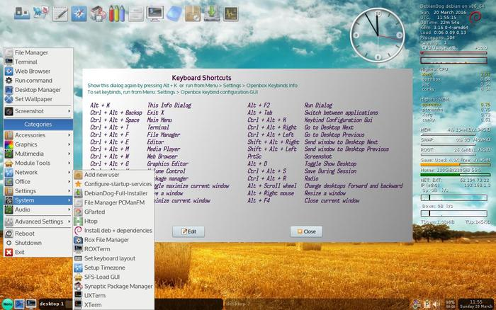
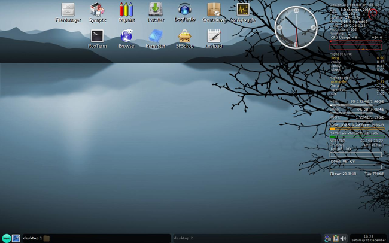

### DebianDog Jessie 64 bit version

[Thread on Puppy Linux forum](http://murga-linux.com/puppy/viewtopic.php?t=101931)

For the most documentation see [DebianDog Jessie](zz01debiandogjessie.html) for Info

Exceptions:    
- Any links to files or repository containing i386 packages (or other non 64 bit packages)    
- Any documentation about live-boot v2 (it's not included in this 64 bit version)    
(maybe I will include later in next iso, porteus-boot and (official Debian) live-boot v3/4 works OK from what I tested)    
- Any documentation about systemd (not included in this 64 bit version, although it can be installed and used, but not properly tested yet)

Other differences compared to 32 bit DebianDog:    
- Different applications, some are missing and some added.    
- Just one version (Openbox) (instead 2 versions that DebianDog 32 bit provides (JWM and Openbox_xfce), see for specifications below)    

## Login details:
**root** with password **root**    
**puppy** with password **puppy**

**Specifications:**    
Built from an absolute minimal Debian-Jessie amd64 full install.    
Kernel: 3.16.0-4-amd64    
Choice of Boot Methods: porteus-boot and live-boot v3 (see for options in documentation from DebianDog - Jessie thread)    
Default WM - OpenBox.    
(with different choice of Desktop modes: tint2 vertical icons, wbar icons or rox-pinboard icons, to choose, run 'Desktop Manager' from Menu)    
Tint2 bottom panel.       
Default File Manager - pcmanfm with option to use rox.    
Default Internet Browser - Palemoon.    
Menu provided by Obmenu-generator (perl script)     

**Download:**

Iso: [DebianDog64-Jessie-openbox-2016-03-20.iso](https://dl.dropboxusercontent.com/u/36381953/DebDog64-Jessie/DebianDog64-Jessie-openbox-2016-03-20.iso) **Size: 185MB**        
Md5sum: [DebianDog64-Jessie-openbox-2016-03-20.md5](https://dl.dropboxusercontent.com/u/36381953/DebDog64-Jessie/DebianDog64-Jessie-openbox-2016-03-20.md5)        

DEVX: [061-DEVX-DebDog64-Jessie-2016-03-20.squashfs](https://dl.dropboxusercontent.com/u/36381953/DebDog64-Jessie/Extra-Modules/061-DEVX-DebDog64-Jessie-2016-03-20.squashfs)    

Locales: [99-locales-DebDog64-2016-03-20.squashfs](https://dl.dropboxusercontent.com/u/36381953/DebDog64-Jessie/Extra-Modules/99-locales-DebDog64-2016-03-20.squashfs)    

Browse [DebDog64-Jessie at DropBox](https://www.dropbox.com/sh/7zw9v8owznjfkze/AADGxeYik7761AX_3jHfxucIa?lst)  

Thanks very much to everyone who has been involved with DebianDog, specially Toni (saintless), William (mcewanw), Terry (sunburnt) and all who helped by giving feedback on the DebianDog threads.

**Screenshots:**    
wbar icons
    
rox-pinboard icons   
    

