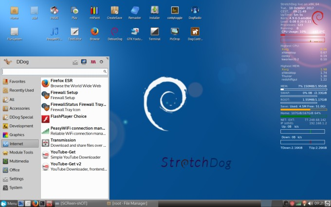
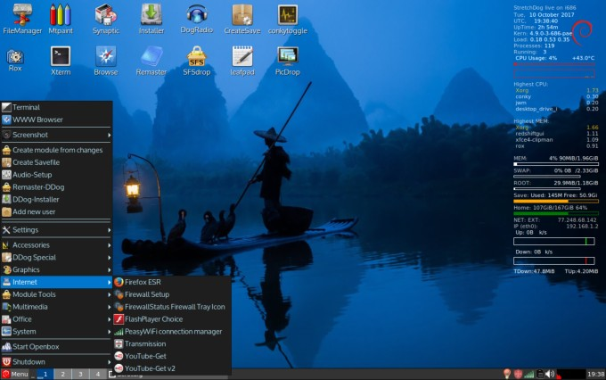

---  

### StretchDog 32 and 64-bit

[Thread on Puppy Linux forum](http://murga-linux.com/puppy/viewtopic.php?t=111789){:target="_blank"}

StretchDog is a variant of DebianDog [Info and credits](index.html){:target="_blank"} based on Debian 9 "Stretch"

Built from scratch by using debootstrap, see also [Here](http://murga-linux.com/puppy/viewtopic.php?t=111199){:target="_blank"} and [Here](https://github.com/DebianDog/MakeLive/blob/gh-pages/README-Stretch.md#create-a-debian-9-stretch-minimal-live-iso-similar-to-debiandog){:target="_blank"}  

[Packages overview from custom repository](https://github.com/DebianDog/MakeLive/blob/gh-pages/README-Packages-Stretch.md#overview-of-packages-in-custom-dog-repositories-for-stretch-from){:target="_blank"}       

### Login details:
**root** with password **root**    
**puppy** with password **puppy**

**Specifications:**          
Kernel: 4.9.0-3      
Choice of Boot Methods: porteus-boot and live-boot v3 (see for options [Here](https://github.com/DebianDog/Jessie/wiki/Boot-methods){:target="_blank"})      
Default WM - OpenBox with on top xfce4-panel and xfdesktop.  
Option to switch to JWM window-manager  
Menu on Openbox_Xfce is (a modified) Whisker-Menu             
Default File Manager - Thunar with option to use rox.      
Default Internet Browser - Firefox.           

**Download:**

Iso 32 bit: [StretchDog32-openbox_xfce-jwm-2017-10-10.iso](https://github.com/fredx181/StretchDog/releases/download/v2.0/StretchDog32-openbox_xfce-jwm-2017-10-10.iso){:target="_blank"} **Size: 242MB**        
Md5sum: [StretchDog32-openbox_xfce-jwm-2017-10-10.md5](https://github.com/fredx181/StretchDog/releases/download/v2.0/StretchDog32-openbox_xfce-jwm-2017-10-10.md5){:target="_blank"}  

Iso 64 bit: [StretchDog64-openbox_xfce-jwm-2017-10-10.iso](https://github.com/fredx181/StretchDog/releases/download/v2.0/StretchDog64-openbox_xfce-jwm-2017-10-10.iso){:target="_blank"} **Size: 256MB**          
Md5sum: [StretchDog64-openbox_xfce-jwm-2017-10-10.md5](https://github.com/fredx181/StretchDog/releases/download/v2.0/StretchDog64-openbox_xfce-jwm-2017-10-10.md5){:target="_blank"}         

DEVX and Firmware squashfs modules: [Here](https://github.com/fredx181/StretchDog/releases/v2.1){:target="_blank"}      

Locales: [099-locales-stretch.squashfs](http://debiandog.github.io/Misc/Stretch/i386/Packages/SFS/099-locales-stretch.squashfs)        
(Locale can be set from Menu > System > Set Locale/Language)  

Thanks very much to everyone who has been involved with DebianDog, specially Toni (saintless), William (mcewanw), Terry (sunburnt), dancytron, belham2, rcrsn51, wiak, jd7654, backi, AndresC2, peebee and all who helped by giving feedback on the DebianDog threads.   

**Screenshots:**    
Openbox with xfce4  
      
JWM     
    

