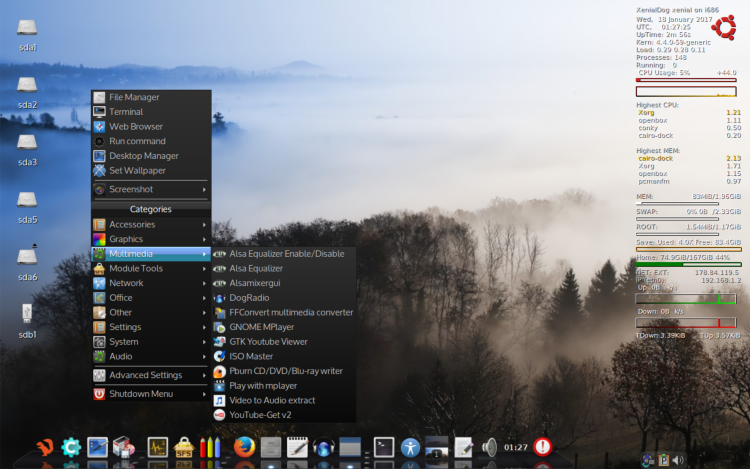

---
<br>

**Update 2017-01-22:**   
ISO upgraded to version 2017-01-22, below information and download links updated

### XenialDog (Ubuntu 16.04 'Xenial Xerus' LTS, 32-bit)
(Ubuntu minimal "live")

[Thread on Puppy Linux forum](http://murga-linux.com/puppy/viewtopic.php?t=106696){:target="_blank"}   

**[See here for Changes and Fixes information](http://murga-linux.com/puppy/viewtopic.php?p=901549#901549)**   

Very similar to DebianDog, but with the difference that it's Ubuntu based.

Full access to Ubuntu repositories by using apt-get (from terminal) or from Synaptic Package Manager (GUI)

Openbox is the main window-manager, the GUI setup is very much like [DebianDog Jessie 64-bit](zz02debiandog64.html)

Differences compared to DebianDog:
    
- Different applications, some are not included and some others added.    
- Choices of window-manager are: Openbox and Jwm , see for specifications below    

### Login details:    
**root** with password **root**        
**puppy** with password **puppy**    

**Specifications:**    
Built from an absolute minimal Ubuntu full install (using mini.iso).    
Kernel: 4.4.0-59-generic    
Choice of Boot Methods: porteus-boot and casper-boot , see options [Here](https://github.com/DebianDog/xenialdog/wiki)   
Default WM - OpenBox (and option for Jwm, see below)    
(with different choice of Desktop modes: tint2 icon-panel, cairo-dock or rox-pinboard icons, to choose, run 'Desktop Manager' from Menu)    
Tint2 bottom panel or cairo-dock.
(replaced wbar (from previous (32-bit) version) with a minimal cairo-dock       
Default File Manager - pcmanfm with option to use rox.    
Default Internet Browser - Firefox.    
Menu provided by Obmenu-generator (perl script)

### Added: Quick-Remaster tool     
 
Option to switch to JWM (Menu > System > Start Jwm)    

Full LZ4 squashfs support (compression and loading modules)    

Systemd is enabled by default, to use upstart (the older Ubuntu initscripts), do in terminal:
    
```
apt-get update # might be required    
apt-get install upstart-sysv
```    
And reboot    

The Iso size became quite big mainly because:    
- Big size of Ubuntu kernel 4.4.0-59-generic (in /lib/modules)    
- Package 'linux-firmware' installed (has most firmware)        
- Python and Perl installed    

**Download:**    
Iso: [XenialDog_32bit-openbox_jwm-2017-01-22-firmware-all.iso](https://github.com/DebianDog/xenialdog/releases/download/v0.1/XenialDog_32bit-openbox_jwm-2017-01-22-firmware-all.iso) **Size: 304MB**        
Md5sum: [XenialDog_32bit-openbox_jwm-2017-01-22-firmware-all.md5](https://github.com/DebianDog/xenialdog/releases/download/v0.1/XenialDog_32bit-openbox_jwm-2017-01-22-firmware-all.md5)   

DEVX: [061-DEVX-XenialDog32-2017-01-18.squashfs](https://github.com/DebianDog/xenialdog/releases/download/v1.0/061-DEVX-XenialDog-2016-05-21.squashfs)    
Locales: [99-locales-XenialDog32-2017-01-18.squashfs](https://github.com/DebianDog/xenialdog/releases/download/v1.0/99-locales-XenialDog-2016-05-21.squashfs)

XenialDog custom package repository:  [Here](https://debiandog.github.io/xenialdog/Packages/){:target="_blank"}        

Thanks very much to everyone who has been involved with DebianDog, specially Toni (saintless), William (mcewanw), Terry (sunburnt) and all who helped by giving feedback on the DebianDog threads.

**Screenshots:**    
OpenBox with cairo-dock    
       
JWM      



<div id="disqus_thread"></div>
<script>

/**
*  RECOMMENDED CONFIGURATION VARIABLES: EDIT AND UNCOMMENT THE SECTION BELOW TO INSERT DYNAMIC VALUES FROM YOUR PLATFORM OR CMS.
*  LEARN WHY DEFINING THESE VARIABLES IS IMPORTANT: https://disqus.com/admin/universalcode/#configuration-variables*/
/*
var disqus_config = function () {
this.page.url = https://debiandog.github.io/doglinux/zz05xenialdog.html;  // Replace PAGE_URL with your page's canonical URL variable
// var disqus_developer = 1; // Comment out when the site is live
        disqus_identifier = "{{ page.url }}";
};
*/
(function() { // DON'T EDIT BELOW THIS LINE
var d = document, s = d.createElement('script');
s.src = 'https://debdog.disqus.com/embed.js';
s.setAttribute('data-timestamp', +new Date());
(d.head || d.body).appendChild(s);
})();
</script>
<noscript>Please enable JavaScript to view the <a href="https://disqus.com/?ref_noscript">comments powered by Disqus.</a></noscript>
   


