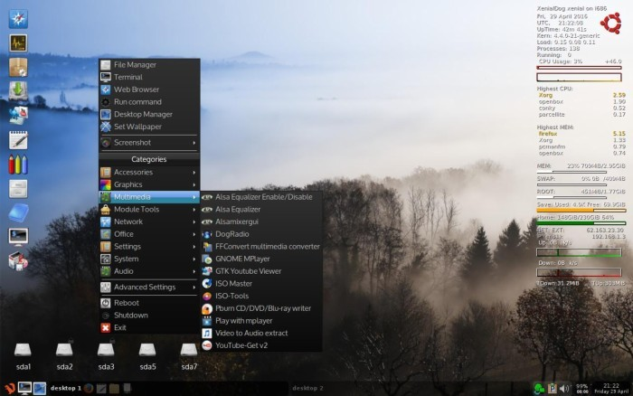
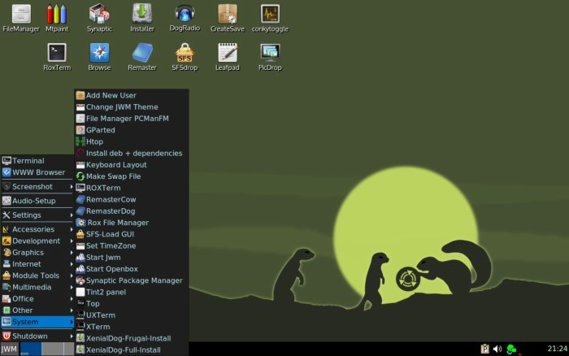

---
<br>

### XenialDog (Ubuntu 16.04 'Xenial Xerus' LTS, 32-bit)
(not to confuse with 'Xenialpup' :) , this is not woof-build, this is Ubuntu minimal "live")

[Thread on Puppy Linux forum](http://murga-linux.com/puppy/viewtopic.php?t=106696){:target="_blank"}

Very similar to DebianDog, but with the difference that it's Ubuntu based, so can be compared best with [MintPup](zz04mintpup.html)

Full access to Ubuntu repositories by using apt-get (from terminal) or from Synaptic Package Manager (GUI)

Openbox is the main window-manager, the GUI setup is very much like [DebianDog Jessie 64-bit](zz02debiandog64.html)

Differences compared to DebianDog or MintPup:
    
- Different applications, some are not included and some others added.    
- Choices of window-manager are: Openbox and Jwm , see for specifications below    

## Login details:    
**root** with password **root**        
**puppy** with password **puppy**    

**Specifications:**    
Built from an absolute minimal Ubuntu full install (using mini.iso).    
Kernel: 4.4.0-21-generic    
Choice of Boot Methods: porteus-boot and casper-boot , see options [Here](https://github.com/DebianDog/xenialdog/wiki){:target="_blank"}    
Default WM - OpenBox (and option for Jwm, see below)    
(with different choice of Desktop modes: tint2 vertical icons, wbar icons or rox-pinboard icons, to choose, run 'Desktop Manager' from Menu)    
Tint2 bottom panel.       
Default File Manager - pcmanfm with option to use rox.    
Default Internet Browser - Firefox.    
Menu provided by Obmenu-generator (perl script)    
 
Option to switch to JWM (Menu > System > Start Jwm)    

Full LZ4 squashfs support (compression and loading modules)    

Systemd is enabled by default, to use upstart (the older Ubuntu initscripts), do in terminal:
    
```
apt-get update # might be required    
apt-get install upstart-sysv
```    
And reboot    

The Iso size became quite big mainly because:    
- Big size of Ubuntu kernel 4.4.0-21-generic (in /lib/modules)    
- Package 'linux-firmware' installed (has most firmware)    
(Edit: Choice now for ISO without 'linux-firmware', see below.)    
- Python and Perl installed    
Possible TODO: make it smaller (but I'm no good with that)

**Download:** Update: Download links pointing to Github now, Previous links didn't work anymore because google-drive seems to have stopped support for direct links        
Firmware-all:    
Iso: [XenialDog-openbox_jwm-2016-05-21-firmware-all.iso](https://github.com/DebianDog/xenialdog/releases/download/v0.1/XenialDog-openbox_jwm-2016-05-21-firmware-all.iso) **Size: 289MB**        
Md5sum: [XenialDog-openbox_jwm-2016-05-21-firmware-all.md5](https://github.com/DebianDog/xenialdog/releases/download/v0.1/XenialDog-openbox_jwm-2016-05-21-firmware-all.md5){:target="_blank"}

Firmware-basic:    
Iso: [XenialDog-openbox_jwm-2016-05-21-firmware-basic.iso](https://github.com/DebianDog/xenialdog/releases/download/v0.1/XenialDog-openbox_jwm-2016-05-21-firmware-basic.iso) **Size: 244MB**        
Md5sum: [XenialDog-openbox_jwm-2016-05-21-firmware-basic.md5](https://github.com/DebianDog/xenialdog/releases/download/v0.1/XenialDog-openbox_jwm-2016-05-21-firmware-basic.md5)        

DEVX: [061-DEVX-XenialDog-2016-05-21.squashfs](https://github.com/DebianDog/xenialdog/releases/download/v1.0/061-DEVX-XenialDog-2016-05-21.squashfs)    

Locales: [99-locales-XenialDog-2016-05-21.squashfs](https://github.com/DebianDog/xenialdog/releases/download/v1.0/99-locales-XenialDog-2016-05-21.squashfs)      

Thanks very much to everyone who has been involved with DebianDog, specially Toni (saintless), William (mcewanw), Terry (sunburnt) and all who helped by giving feedback on the DebianDog threads.


**Screenshots:**    
OpenBox    
    
JWM      
 


[comment]: #  Experiments with colors
[comment]: # * To add this repository to your Debian-based system, in /etc/apt/sources.list:   
[comment]: # ```
[comment]: # deb http://doglinux.github.io/dogs/XenialDog/Packages/ ./
[comment]: # ```


