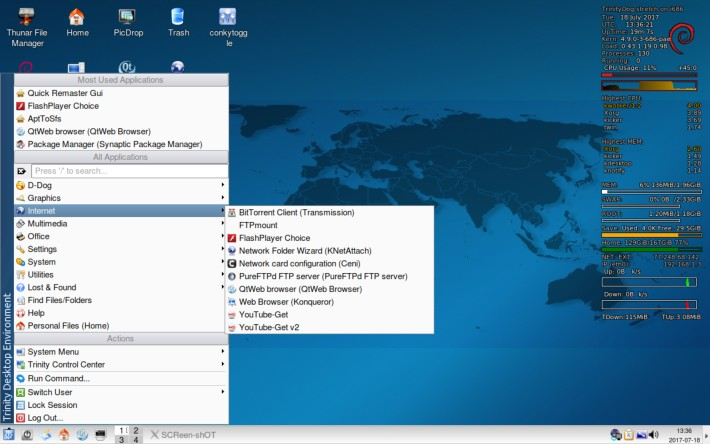

---
 

### TrinityDog Jessie & Stretch versions 32-bit   

**TrinityDog is a fork of "DebianDog"** (info and credits [Here](index.html){:target="_blank"}) with a basic [Trinity Desktop Environment](https://www.trinitydesktop.org/){:target="_blank"}   

[Forum Thread](http://murga-linux.com/puppy/viewtopic.php?t=111075){:target="_blank"}   
   
A Jessie test version was earlier shared already [Here](http://murga-linux.com/puppy/viewtopic.php?p=945453#945453){:target="_blank"}          

Full access to Debian repositories by using apt-get (from terminal) or from Synaptic Package Manager (GUI)     

### Login details:    
**root** with password **root**        
**puppy** with password **puppy**    

**Specifications:**   
Jessie kernel version: **3.16.0-4-686-pae**  
Stretch kernel version: **4.9.0-3-686-pae**             
Choice of Boot Methods: porteus-boot and live-boot , see options [Here](https://github.com/DebianDog/Jessie/wiki/Boot-methods){:target="_blank"} (except live-boot-2 which is not supported)            
File Managers - Thunar and Konqueror.
(Thunar is recommended because of more support for right-click custom actions)    
Internet Browser - QtWeb (and Konqueror).   
(included the light (although outdated) browser QtWeb to keep the size of the ISO smaller, and most people will install a browser of choice anyway, e.g. Firefox))
(thanks to OscarTalks for QtWeb pet)      
NetworkManager for Stretch version is Ceni, Jessie version has Frisbee.

**Download TrinityDog-Jessie:** (based on Debian 8, LTS, supported at least until 2020)     
Iso: [TrinityDog-Jessie-2017-07-18.iso](https://github.com/DebianDog/trinitydog/releases/download/v1.0/TrinityDog-Jessie-2017-07-18.iso){:target="_blank"} Size: 262MB           
Md5sum: [TrinityDog-Jessie-2017-07-18.md5](https://github.com/DebianDog/trinitydog/releases/download/v1.0/TrinityDog-Jessie-2017-07-18.md5){:target="_blank"}      

DEVX: [61-DEVX-Jessie-2017-07-18.squashfs](https://github.com/DebianDog/trinitydog/releases/download/v1.0/61-DEVX-Jessie-2017-07-18.squashfs){:target="_blank"}      
Firmware squashfs: [51-firmware-jessie-2017-07-18.squashfs](https://github.com/DebianDog/trinitydog/releases/download/v1.0/51-firmware-jessie-2017-07-18.squashfs){:target="_blank"}          
Locales squashfs: [99-locales-jessie-2017-07-18.squashfs](https://debiandog.github.io/Misc/Jessie/i386/Packages/SFS/99-locales-jessie-2017-07-18.squashfs){:target="_blank"}      
        

**Download TrinityDog-Stretch:** (based on Debian 9, LTS, supported at least until 2022)        
Iso: [TrinityDog-Stretch-2017-07-18.iso](https://github.com/DebianDog/trinitydog/releases/download/v2.0/TrinityDog-Stretch-2017-07-18.iso){:target="_blank"} Size: 286MB           
Md5sum: [TrinityDog-Stretch-2017-07-18.md5](https://github.com/DebianDog/trinitydog/releases/download/v2.0/TrinityDog-Stretch-2017-07-18.md5){:target="_blank"}   

DEVX: [61-DEVX-Stretch-2017-07-18.squashfs](https://github.com/DebianDog/trinitydog/releases/download/v2.0/61-DEVX-Stretch-2017-07-18.squashfs){:target="_blank"}   
Firmware squashfs: [51-firmware-stretch-2017-07-18.squashfs](https://github.com/DebianDog/trinitydog/releases/download/v2.0/51-firmware-stretch-2017-07-18.squashfs){:target="_blank"}       
Locales squashfs: [099-locales-stretch.squashfs](https://debiandog.github.io/Misc/Stretch/i386/Packages/SFS/099-locales-stretch.squashfs){:target="_blank"}   

Custom Jessie package repository:  [Here](https://debiandog.github.io/Jessie/i386/Packages/){:target="_blank"}     
Custom Stretch package repository:  [Here](https://fredx181.github.io/StretchDog/i386/Packages/){:target="_blank"}             

Thanks very much to everyone who has been involved with DebianDog or XenialDog, specially Toni (saintless), William (mcewanw), Terry (sunburnt), dancytron, backi, belham2, The Flying Cat and all who helped by giving feedback on the DebianDog threads.   

**Screenshot:**                  
 

